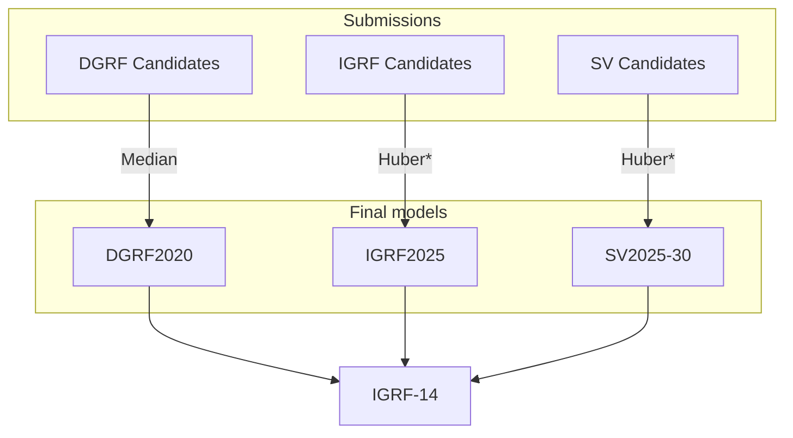

# IGRF-14 Evaluation

[](https://iaga-vmod.github.io/IGRF14eval/)
[](https://mybinder.org/v2/gh/IAGA-VMOD/IGRF14eval/main)
[](https://doi.org/10.5281/zenodo.14205633)

---

**NB: If you are looking for the IGRF-14 release itself, see https://doi.org/10.5281/zenodo.14012302 and https://www.ncei.noaa.gov/products/international-geomagnetic-reference-field**

This repository was used to collate and evaluate the candidate models that contributed to IGRF-14. Check the Book and Binder links above to view and execute the notebooks.

---

## Repository layout

```
binder/
   # Configuration for Binder service
bookbuilder/
   # Conda environment to generate Jupyter Book (html)
data/
   # Data files, including candidate coefficients and release coefficients
docs/
   # Reports from candidate teams
lockfiles/
   # Conda environment against which to execute notebooks
matlab/
   # Matlab code to run separately (Huber-weighted mean in space) - used for IGRF2025 and SV2025-30
notebooks/
   # Jupyter Notebooks that verify and compare candidate models
scripts/
   # .py files synchronised with notebooks using jupytext
src/
   # Python module used by notebooks
```

## Overview of process



*Huber = Huber-weighted mean in space*

1. Modelling teams submitted candidates for one or more of (DGRF, IGRF, SV)  
   *See `data/coefficients/`*
2. Task Force evaluated and compared models
3. Task Force voted on method of merging each set of model coefficients


## Candidate evaluation

Based on:
Alken, P., Thébault, E., Beggan, C.D. et al. Evaluation of candidate models for the 13th generation
International Geomagnetic Reference Field. Earth Planets Space 73, 48 (2021).
https://doi.org/10.1186/s40623-020-01281-4

Tests are:

0) Check files are correctly formatted, then:
1) Lowes-Mauerberger power spectra plots
2) Root-mean-square differences between candidates
3) Degree correlation plot of differences between one candidate and all others
4) Azimuthal spectra plot of the differences between one candidate and the others
5) Triangle plot of differences between one candidate and the others
6) Spatial maps of comparison in X, Y, Z, Br, Bt, Bp between one candidate and the others

Code based on GitHub repos: IAGA Summer School Python exercises and ChaosMagPy

## Submission guide

1. Prepare your model coefficients in the `.cof` format
2. Test them by running the notebooks:  
   a) Using the [Binder link](https://mybinder.org/v2/gh/IAGA-VMOD/IGRF14eval/main)  
   b) Locally on your machine (see below)  
3. Open a Pull Request to add your model coefficients. You can do this through the GitHub web interface (see instructions in [docs/submission_guide_GitHub_web.pdf](docs/submission_guide_GitHub_web.pdf)), or using git yourself:  
   a) [Fork](https://github.com/IAGA-VMOD/IGRF14eval/fork) this repository  
   b) Clone your fork onto your machine  
   c) Create a branch and add your coefficients  
      ```
      git checkout -b <branch-name>
      git add data/coefficients/DGRF/DGRF_<candidate-name>.cof
      git add data/coefficients/IGRF/IGRF_<candidate-name>.cof
      git add data/coefficients/SV/SV_<candidate-name>.cof
      git commit -m "Add coefficients for ..."
      git push
      ```
   d) Open the Pull Request [here](https://github.com/IAGA-VMOD/IGRF14eval/compare)

## Local development

**Setting up the environment:**

- This can be done manually without using conda if you provide `numpy`, `pandas`, `matplotlib`, `pyshp` (check [environment-base.yml](https://github.com/IAGA-VMOD/IGRF14eval/blob/main/environment-base.yml) for specific versions).
- (Recommended) Use the conda lockfile for your platform. Run one of:
    ```
    conda create --name igrf --file lockfiles/conda-linux-64.lock
    conda create --name igrf --file lockfiles/conda-osx-64.lock
    conda create --name igrf --file lockfiles/conda-osx-arm64.lock
    conda create --name igrf --file lockfiles/conda-win-64.lock
    ```
    (and activate it with `conda activate igrf` when you need to use it)

**Running the code:**

The code is provided as three notebooks/scripts in the `/notebooks/` directory. There are two copies of each: in `.py` format and in Jupyter notebook `.ipynb` format. You can use whichever you are more comfortable with.

JupyterLab is provided in the conda environment so you can run it with `jupyter-lab` to use the notebooks.
